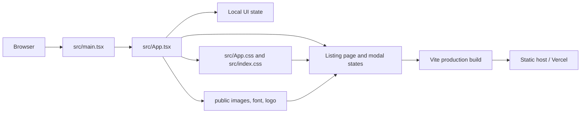

# Architecture Overview

## Purpose

This project is a responsive, front-end Airbnb listing clone built with React, TypeScript, and Vite. The saved reference listing is the visual source of truth for the layout, copy, typography, imagery, and interaction states.

The architecture is deliberately small: one page, local mock data, local assets, and component state. That keeps the submission deterministic and easy to run without a backend or environment variables.

See the companion visual diagram in [architecture-diagram.svg](architecture-diagram.svg).

## System at a glance



## Technology layers

| Layer | Responsibility | Main files |
| --- | --- | --- |
| Entry point | Mounts React into the HTML root element | `src/main.tsx` |
| Page composition | Renders the listing, sections, and overlays | `src/App.tsx` |
| Presentation | Layout, responsive rules, states, and visual styling | `src/App.css`, `src/index.css` |
| UI primitives | Familiar controls and interface icons | `lucide-react` |
| Static content | Listing photos, host image, rating chips, logo, and font | `public/` |
| Delivery | Type-checks, bundles, and serves the static app | `package.json`, `vite.config.ts`, `vercel.json` |

## Runtime flow

1. Vite serves `index.html` and loads `src/main.tsx`.
2. `main.tsx` mounts the `App` component into `#root`.
3. `App` renders the listing page from local arrays for photos, amenities, reviews, and nearby stays.
4. User actions update local React state and change the visible UI without a network request.
5. CSS controls the responsive desktop/mobile layout and visual states.
6. Vite compiles the same entry point into the deployable `dist/` folder.

## State and interaction boundaries

The page keeps transient interaction state inside `App`:

- `saved`: toggles the Save button state.
- `tourOpen`: opens the full photo-tour overlay.
- `lightboxIndex`: controls the active photo and previous/next navigation.
- `amenitiesOpen`: opens the full amenities modal.
- `descriptionOpen` and `reviewsOpen`: expand and collapse content.
- `monthOffset`: changes the displayed calendar months.
- `stickyVisible`: controls the sticky navigation visibility on scroll.
- `toast`: displays short feedback messages for actions such as Share and Reserve.

The app also registers a small keyboard/scroll effect boundary for Escape, arrow-key photo navigation, and sticky navigation behavior. Overlay state locks body scrolling while a modal is open.

## Page composition

1. Header with logo, search controls, and account actions
2. Sticky section navigation and reservation summary
3. Listing title, Share/Save actions, and photo gallery
4. Property summary and host identity
5. Guest favourite and feature highlights
6. About section and sleeping arrangements
7. Amenities and expanded amenities modal
8. Calendar-style stay dates and reservation sidebar
9. Reviews and rating categories
10. Location map mock, host card, and things to know
11. Nearby stay cards
12. Photo tour and lightbox overlays

## Data and persistence

There is no API, database, authentication, payment flow, or server-side persistence. Listing content is static mock data embedded in `src/App.tsx`. This is intentional for a visual front-end submission and ensures the page renders consistently offline after dependencies are installed.

## Build and deployment

```text
npm install -> npm run lint -> npm run build -> dist/
											  -> Vercel/static host
```

`vercel.json` provides SPA fallback routing so direct browser requests resolve to `index.html`. The application can also be hosted on Netlify, GitHub Pages, or any static file host configured for Vite output.

## Submission boundaries

- Included: responsive UI, reference-aligned copy and assets, gallery/lightbox, modal amenities, calendar display, reviews, host/location sections, documentation, and deployment configuration.
- Intentionally omitted: real booking transactions, user accounts, payments, backend availability, and database persistence.
- Validation commands: `npm run lint` and `npm run build`.
